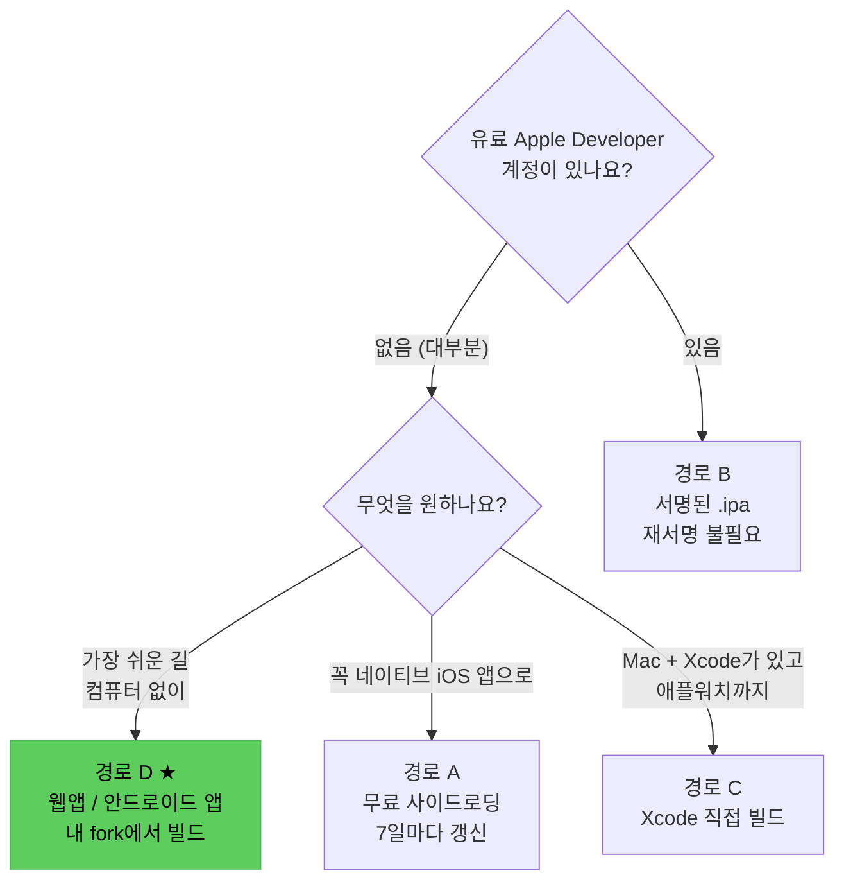
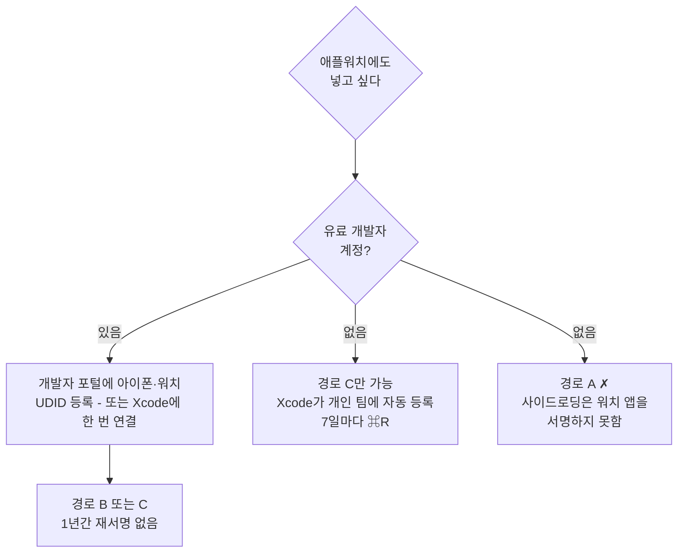
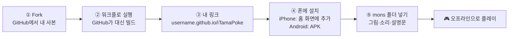
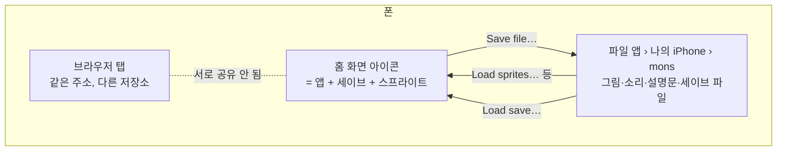
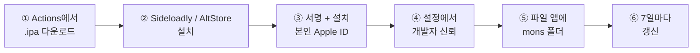

# 설치 가이드 (코딩 지식 불필요)

[English](INSTALL.md)

파일을 다운로드하고 단계를 따라할 수 있다는 것 외엔 아무것도 필요 없습니다.
설명 없이 나오는 용어는 처음 등장할 때 바로 설명합니다.

> ⚠️ **시작 전에:** 이건 혼자 만든 취미 포팅 프로젝트이지, 완성된 상용
> 앱이 아닙니다. 뭔가 안 되면 사용자 잘못이 아닐 가능성이 큽니다 — 이
> 문서 맨 아래 "막히는 부분"을 먼저 보세요.

## 한눈에 보기



| 경로 | 추천 | 필요한 것 | 시간 | 만료 | 애플워치 |
|---|---|---|---|---|---|
| **D 웹앱 / 안드로이드** | ★★★ 처음이라면 이것 | 폰, 무료 GitHub 계정 | fork 10분 + 설치 1분 | 없음 | ✗ |
| C Xcode 직접 빌드 | ★★ 가장 편함, 안정성은 다소 낮음 | Mac + Xcode | 20분 | 무료 ID 7일 / 유료 계정 1년 | ✓ |
| B 서명된 설치 | ★★ 가장 안정적, 조건이 많음 | 유료 개발자 계정 + Mac + 약간의 개발 지식 | 10분 | 1년 | ✓ (기기 등록 필요) |
| A 무료 사이드로딩 | ★ 비추천 | 아이폰, Mac 또는 Windows, 무료 Apple ID | 15분 | 7일마다 갱신 | ✗ |

**처음이라면 경로 D**로 가세요. 어느 경로든 게임은 **캐릭터 그림 없이**
설치되고, 그림·소리·도감 설명문은 본인이 직접 넣습니다 → [mons 폴더
구성하기](#mons-폴더-구성하기).

### 애플워치와 개발자 계정



- **기기 등록이 핵심입니다.** 서명된 빌드는 프로파일에 UDID가 들어 있는
  기기에만 설치됩니다. 유료 계정은 포털(Certificates, Identifiers &
  Profiles → Devices)에 아이폰과 워치를 **미리** 등록해 두세요. Xcode에
  기기를 한 번 연결해도 등록됩니다. GitHub Actions의 "Build (signed)"는
  기기를 등록해 주지 못합니다.
- **무료 Apple ID**는 포털이 없지만, Xcode가 연결된 기기를 "개인 팀"에
  자동 등록하고 7일짜리 프로파일로 설치합니다. 그래서 경로 C는 무료 ID로도
  워치까지 되고, 대신 7일마다 다시 빌드해야 합니다.
- **무료 ID로 안 되는 것**: 사이드로딩으로 워치 앱 설치(경로 A), Actions
  서명 빌드(경로 B).

---

## 경로 D — 내 fork에서 만드는 웹앱 / 안드로이드 앱 ★

같은 게임(같은 엔진, 같은 화면)을 웹앱과 안드로이드 패키지로 만든
것입니다. 흐름은 이렇습니다.



**공용 링크는 없습니다.** 이 저장소는 게임을 남에게 호스팅하지 않습니다.
GitHub가 *본인 계정 아래에* 사본을 빌드해 주고(D0), 그 링크는 이 저장소에
무슨 일이 생겨도 계속 동작합니다. LICENSE가 허용하는 형태이기도 합니다
(본인용 개인 빌드, 남에게 돌리는 링크는 아님).

**게임이 남과 공유되나요?** 아니요. 링크는 프로그램만 전달합니다.
캐릭터·레벨·도감·포획 기록·스프라이트는 전부 **내 폰 안**(앱 저장소)에만
있고, 계정도 서버 저장도 없습니다.

### D0. 나만의 링크 만들기 (10분, 한 번만)

무료 GitHub 계정이 필요합니다. 폰 브라우저에서도 되지만 컴퓨터가 편합니다.

1. GitHub에 로그인하고 이 저장소를 엽니다.
2. 오른쪽 위 **Fork** → **Create fork**. `github.com/<내아이디>/iTamaPoke`에
   본인 사본이 생깁니다. 공개 상태로 두세요(무료 계정의 Pages는 공개
   저장소에서만 됩니다).
3. *본인 사본*에서 **Settings** → 왼쪽 **Pages** → **Build and deployment**의
   **Source**를 **GitHub Actions**로.
4. **Actions** 탭 → **I understand my workflows, go ahead and enable them** →
   왼쪽 **Build (browser)** → **Run workflow** → **Run workflow**.
5. 초록색 체크 ✅까지 약 5분. 링크는
   **`https://<내아이디>.github.io/iTamaPoke/`** (실행 페이지 *publish*
   아래에도 표시).

이후 업데이트: 본인 사본에서 **Sync fork** → **Update branch**. 사이트가
알아서 다시 빌드되고, 설치된 앱은 다음 실행 때 반영됩니다.

### D1. 설치 (1분)

| | 아이폰 / 아이패드 | 안드로이드 |
|---|---|---|
| 여는 앱 | **Safari** (Chrome·앱 내장 브라우저 ✗) | **Chrome** |
| 주소 | `https://<내아이디>.github.io/iTamaPoke/` | `https://<내아이디>.github.io/iTamaPoke/iTamaPoke.apk` |
| 설치 | 공유 버튼 → **홈 화면에 추가** → **추가** | 다운로드된 파일 탭 → "출처를 알 수 없는 앱" 허용 → **설치** |
| 업데이트 | 자동 (인터넷 연결된 다음 실행) | 새 `.apk` 덮어 설치 (세이브 유지) |

설치 후에는 **항상 홈 화면 아이콘으로** 여세요. 브라우저 탭에서 같은
주소를 열면 그건 *별개의 앱*(별개 세이브·별개 스프라이트)입니다. 처음
스프라이트를 넣었는데 아이콘으로 열면 안 보이는 경우가 바로 이것입니다.

> 안드로이드에서 APK가 꺼려지면 웹 링크도 Chrome에서 됩니다(⋮ → **앱
> 설치**). 규칙은 아이폰과 같습니다.

### D2. 아이콘·세이브 규칙 (한 번만 읽어두세요)



- **세이브는 아이콘 안에** 있습니다. 15초마다, 그리고 화면을 벗어날 때
  자동 저장됩니다.
- **아이콘을 지우면 세이브도 지워집니다**(아이폰). 재설치 전에 **Save
  file…**로 파일을 빼두세요.
- **Save file…**(화면 오른쪽 버튼): 현재 상태를 `iTamaPoke-save.tpsave`
  파일로 내보냅니다. 아이폰은 공유 시트가 뜨니 **파일에 저장** → `mons`
  폴더에 두면 됩니다. 이게 백업이고, 다른 폰으로 옮기는 방법입니다.
- **Load save…**: 그 파일을 골라 되돌립니다(현재 캐릭터를 대체).
- **Reset game…**: 세이브만 지우고 새 알부터. 스프라이트는 남습니다.
  잘못된 상태가 계속 보일 때 쓰세요.
- 첫 실행 뒤에는 **인터넷이 필요 없습니다.**

### D3. 캐릭터 넣기 (5분, 기기당 한 번)

처음엔 캐릭터 자리에 "?"만 보입니다. 일부러 그런 것입니다 — 그림은
저장소에도 앱에도 없고([README "스프라이트"](../README.ko.md#스프라이트)),
본인이 넣습니다.

1. `mons` 폴더를 준비해 폰의 **파일 앱 → 나의 iPhone**(안드로이드: 내 파일 →
   내장 저장공간)에 둡니다. 구성 방법은 바로 아래 [mons 폴더
   구성하기](#mons-폴더-구성하기).
2. 아이콘으로 iTamaPoke를 열고 오른쪽 위 **Load sprites…** 탭.
3. 선택 창에서 `mons` 폴더로 들어가 **파일 하나 탭 → 선택 → 모두 선택 →
   열기**. 다른 종류 파일이 섞여 있어도 버튼마다 자기 확장자만 가져가므로
   그냥 전부 선택하면 됩니다.
4. 아래 개수 표시가 끝나면 캐릭터가 바로 나타납니다. 앱 안에 저장되므로
   한 번이면 됩니다.
5. 울음소리·도감 설명문도 같은 폴더에 있으면 **Load cries…**, **Load dex
   text…**에서 같은 방식으로 "모두 선택" 한 번씩.

### D4. 컴퓨터에서 쓰려면

같은 링크가 데스크톱 브라우저에서도 그대로 됩니다. Chrome/Edge는 주소창에
**설치** 버튼이 떠서 창 하나짜리 앱으로 쓸 수 있습니다. 세이브는
브라우저별이고, **Save file…/Load save…**로 폰과 주고받을 수 있습니다.

### 링크는 혼자만 쓰세요

LICENSE는 본인 fork의 사이트를 본인 플레이용으로만 허용하고, 남들이 게임을
받아가는 곳으로 쓰는 건 허용하지 않습니다. 친구가 원하면 이 저장소를
알려줘서 D0으로 각자 만들게 하세요.

개발자용: 사이트는
[`.github/workflows/build-browser.yml`](../.github/workflows/build-browser.yml)이
만듭니다(Emscripten이 `upstream-expanded/` + `browser_ver/core/`를 WASM으로
컴파일, Gradle이 안드로이드 셸 빌드, 폴더를 GitHub Pages에 배포). 로컬
빌드는 `browser_ver/README.md`.

---

## mons 폴더 구성하기

모든 경로가 같은 폴더 하나를 씁니다. 이름은 정확히 `mons`.

```
mons/
├── p001.bin … p386.bin        캐릭터 스프라이트 (일반)            ← 필수
├── ps001.bin … ps386.bin      캐릭터 스프라이트 (이로치)          선택
├── thumbs.bin                 도감 썸네일 모음                    iOS 앱만 필수
├── dex_entries_ko.txt         도감 설명문 (언어별 한 파일)        선택
├── dex_entries_en.txt
├── psnd001.m4a … psnd386.m4a  울음소리                            선택
├── iTamaPoke-save.json        iOS 앱의 세이브 (앱이 직접 씀)
└── iTamaPoke-save.tpsave      웹앱/안드로이드의 세이브 (Save file…로 내보낸 것)
```

| 파일 | 어디서 | 방법 |
|---|---|---|
| `p###.bin`, `thumbs.bin` | [socquique/TamaPoke](https://github.com/socquique/TamaPoke) | **Code → Download ZIP** → `tools/sdcard/mons` 폴더 통째로 |
| `ps###.bin` (이로치) | PMD SpriteCollab | 컴퓨터에서 `Scripts/pack_shiny_sprites.py` (선택) |
| `dex_entries_<언어>.txt` | PokéAPI | 컴퓨터에서 `Scripts/fetch_dex_entries.sh --lang ko` |
| `psnd###.m4a` | PokéAPI cries | 컴퓨터에서 `Scripts/fetch_cries.sh` (`ffmpeg` 필요) |
| 위 전부 한 번에 | | `Scripts/fetch_assets.sh` |

- **폰만 있을 때**: 첫 줄(ZIP)만으로 충분합니다. 폰 Safari로 ZIP을 받고
  파일 앱에서 탭해 풀면 `TamaPoke-main/tools/sdcard/mons`가 나옵니다. 그
  `mons`를 **나의 iPhone** 바로 아래로 옮겨두면 이후가 편합니다.
- **컴퓨터가 있을 때**: 저장소를 clone한 뒤 `Scripts/fetch_assets.sh`를
  실행하면 `Resources/mons/`에 전부 생깁니다. 그 폴더를 AirDrop이나 클라우드
  드라이브로 폰에 옮기세요.
- **이로치(`ps###.bin`)는 오래 걸립니다.** `pack_shiny_sprites.py`는 PMD
  SpriteCollab에서 386종의 원본 시트를 하나씩 받아 변환하므로 회선에 따라
  수십 분에서 한 시간 이상 걸릴 수 있습니다. 급하면 원하는 종만 번호로
  지정하세요(`Scripts/fetch_assets.sh --only shiny 25 133`처럼). 사이트에서
  직접 한 장씩 받는 것도 가능하지만 종별 폴더를 찾아다녀야 해서 더
  번거롭습니다.
- 일부만 넣어도 됩니다. 파일이 없는 종은 "?"로 표시될 뿐 오류는 없습니다.
- 어느 파일도 이 저장소에 들어 있지 않고, 앱이 어디로 업로드하지도
  않습니다.

**어디에 두나요?**

| | 위치 |
|---|---|
| iOS 앱 (경로 A/B/C) | 파일 앱 → 나의 iPhone → **iTamaPoke** → `mons` (앱이 자동으로 읽음) |
| 웹앱 / 안드로이드 (경로 D) | 파일 앱 → 나의 iPhone → `mons` (아무 곳이나 됨, **Load sprites…**로 직접 고름) |

---

## 경로 A — 무료 설치 (Sideloadly 또는 AltStore)

**Mac과 Windows 둘 다** 가능합니다. 필요한 것: 아이폰, USB 케이블(최초
한 번), 무료 Apple ID(앱스토어 쓰실 때 쓰는 것과 같은 종류 — 유료 계정
아님).



### 1. 앱 파일 다운로드

1. 이 저장소 페이지를 브라우저로 열고 위쪽의 **Actions** 탭을 클릭합니다.
2. 왼쪽에서 **Build (unsigned)**를 클릭합니다.
3. 목록 맨 위의 가장 최근 실행을 클릭합니다 — 초록색 체크 ✅가 있어야
   합니다.
4. 아래로 스크롤하면 **Artifacts** 아래 파일이 두 개 있습니다.
   **`TamaPoke-unsigned-nowatch-ipa`**(아이폰 전용)를 다운로드하세요.
   `.zip`으로 받아지니 압축을 풀면 `TamaPoke-unsigned-nowatch.ipa` 파일이
   나옵니다. 이게 앱 파일이고, 아직 내 폰용으로 서명은 안 된 상태입니다.

   > `TamaPoke-unsigned-withwatch-ipa`는 무시하세요. 무료 Apple ID는
   > 임베드된 두 번째 watchOS 앱까지 프로비저닝할 수 없어서 AltStore는 이
   > 파일 자체를 설치 거부하고, Sideloadly는 워치 부분을 조용히 빠뜨립니다.
   > 유료 계정 없이 워치에 넣고 싶다면 **경로 C**를 이용하세요.

### 2. 사이드로딩 도구 설치

인터넷에서 받은 `.ipa`는 아직 본인 Apple 계정으로 서명되어 있지 않아서
iOS가 바로 설치해주지 않습니다. **사이드로딩 도구**가 본인의 무료 Apple
ID로 먼저 서명해줍니다. 둘 중 하나를 고르세요:

- **[AltStore](https://altstore.io)** — 앱이 자동으로 계속 갱신되길
  원하면 추천(6단계 참고). Windows, Mac 둘 다 지원.
- **[Sideloadly](https://sideloadly.io)** — 한 번 설치는 더 간단하지만
  7일마다 손으로 갱신해야 함. 마찬가지로 Windows, Mac 둘 다 지원.

### 3. 서명하고 설치하기

**Sideloadly 사용 시:**
1. 아이폰을 USB로 컴퓨터에 연결하고 Sideloadly를 엽니다.
2. `TamaPoke-unsigned-nowatch.ipa`를 Sideloadly 창으로 드래그합니다.
3. Apple ID 이메일을 입력란에 씁니다.
4. **Start**를 클릭합니다. 중간에 Apple ID 비밀번호를 물어보는데, 이건
   Apple 서버로 직접 전달되어 서명하는 용도입니다.
5. 끝날 때까지 기다립니다. 홈 화면에 앱이 생깁니다.

**AltStore 사용 시:**
1. 컴퓨터에 **AltServer**를 설치하고(altstore.io) 안내를 따라갑니다 —
   최초 1회 아이폰을 연결해서 AltStore 앱을 설치해줍니다.
2. 아이폰과 컴퓨터가 **같은 Wi-Fi**에 있는지 확인합니다.
3. 아이폰에서 **AltStore** 앱 → **My Apps** → **+** 버튼 →
   `TamaPoke-unsigned-nowatch.ipa` 선택.
4. Apple ID를 물어보면 입력합니다. 설치될 때까지 기다립니다.

### 4. 아이폰에서 신뢰하기

처음 열려고 하면 iOS가 "개발자를 신뢰할 수 없음"이라고 거부합니다. 한 번만
고치면 됩니다: **설정 → 일반 → VPN 및 기기 관리** → "개발자 앱" 아래
항목(본인 Apple ID) 탭 → **신뢰**.

### 5. 캐릭터 아트 추가하기

[mons 폴더 구성하기](#mons-폴더-구성하기)대로 `mons`를 만든 뒤:

1. 아이폰에서 **파일** 앱 → **내 iPhone** → **iTamaPoke**를 엽니다.
2. 그 안에 `mons` 폴더를 통째로 옮깁니다. **`thumbs.bin`도 꼭 포함하세요**
   — 이게 없으면 도감 화면이 텅 비어 보입니다.
3. iTamaPoke 앱을 완전히 종료(앱 전환기에서 위로 스와이프)했다가 다시
   엽니다.


*정상 설치됐을 때 도감 상세화면 — 초상화·타입·울음소리 재생 버튼이 전부
나옵니다.*

### 6. 계속 작동하게 유지하기 (7일마다)

무료 Apple ID로 서명된 앱은 **7일**이 지나면 실행이 멈춥니다 — Apple의 무료
계정 제한입니다.

- **AltStore 사용자:** 컴퓨터에서 AltServer를 계속 켜두고, 가끔 아이폰을
  같은 Wi-Fi에 연결해두면 자동으로 갱신됩니다.
- **Sideloadly 사용자:** 일주일에 한 번 3단계를 반복하세요. 저장 데이터는
  영향받지 않습니다.

무료 Apple ID는 이런 식으로 사이드로드한 앱을 동시에 **3개까지만** 설치할
수 있습니다.

---

## 경로 B — 서명된 설치 (유료 Apple Developer 계정)

이미 연 $99를 내는 Apple Developer 계정이 있다면, 사이드로딩 도구 없이
바로 설치되고 1년 동안 재서명이 필요 없습니다. 빌드는 GitHub가 하지만
`.ipa`를 기기에 넣는 데 Apple Configurator나 Xcode가 필요해서 **실제로는
Mac이 있어야** 하고, 시크릿 등록 등 약간의 개발 지식이 필요합니다.

> **먼저 기기를 등록하세요.** 아이폰과 애플워치의 UDID가 개발자 포털
> (Devices)에 있어야 서명된 빌드가 설치됩니다. Xcode에 각 기기를 한 번
> 연결하면 자동 등록됩니다. 이 워크플로는 기기를 등록해 주지 않습니다.

> 본인이 직접 fork한 저장소가 아니라면, 먼저 `project.yml`의
> `PRODUCT_BUNDLE_IDENTIFIER`를 `com.allenst486db.itamapoke`가 아닌
> 본인만의 고유한 값으로 바꾸세요.

1. 이 저장소의 **Settings → Secrets and variables → Actions**에서 시크릿
   4개를 등록합니다 — 값을 어디서 가져오는지는
   [`.github/workflows/build-signed.yml`](../.github/workflows/build-signed.yml)
   맨 위 주석을 참고하세요.
2. **Actions** 탭 → **Build (signed)** → **Run workflow**.
3. 완료되면 경로 A의 1단계와 같은 방식으로 `TamaPoke-signed-ipa`를
   다운로드합니다.
4. Apple Configurator나 Xcode의 Devices 창으로 설치합니다.
5. 경로 A의 5단계와 동일하게 `mons` 폴더를 넣습니다.

이 경로는 애플워치 앱도 정상 설치되고, 1년 동안 만료되지 않습니다.

---

## 경로 C — Xcode로 직접 빌드 (Mac만 가능)

이미 Xcode가 설치된 Mac이 있고 터미널에 명령어 몇 개 입력하는 게 괜찮은
분들을 위한 방법입니다. 애플워치만큼은 이 방법이 가장 확실하고, `mons`를
빌드에 바로 내장할 수 있습니다.

```bash
git clone --recurse-submodules https://github.com/allenst486db/iTamaPoke
cd iTamaPoke
brew install xcodegen
Scripts/fetch_assets.sh          # 스프라이트·이로치·울음소리 -> Resources/mons/
xcodegen generate
open TamaPoke.xcodeproj
```

Xcode에서: **TamaPoke** 타겟 선택 → *Signing & Capabilities* → *Automatically
manage signing* 켜기 → 본인 Apple ID를 팀으로 선택. **TamaPokeWatch**도
동일하게. 아이폰을 연결하고 실행 대상으로 선택한 뒤 ⌘R. 워치는
**TamaPokeWatch** 스킴과 본인 애플워치로 대상 바꿔서 반복.

iOS 16+ / watchOS 9+ 모두 **개발자 모드**를 한 번 켜야 합니다: 설정 → 개인정보
보호 및 보안 → 개발자 모드 → 켜기, 재시작.

**만료:** 무료 Apple ID는 7일 후 만료되니 ⌘R을 다시 누르면 됩니다(워치도
같이). 유료 계정으로 서명하면 1년입니다 — 이때 기기는 Xcode가 연결 시
포털에 자동 등록합니다.

Mac이 있다면 이 경로가 가장 손이 덜 갑니다. 다만 Xcode 버전·서명 상태에
따라 한 번씩 막히는 일이 있어, 안정성 자체는 경로 B의 서명된 `.ipa`가 더
확실합니다.

### 앱 아이콘

기본으로 작은 마스코트 아이콘이 포함되어 있습니다. 본인 이미지를 쓰려면:

```bash
Scripts/fetch_app_icon.sh path/to/icon.png   # 정사각형, 가급적 1024x1024
xcodegen generate
```

---

## 막히는 부분

### 경로 D (웹앱 / 안드로이드)

| 증상 | 원인 → 해결 |
|---|---|
| 아차모를 골랐는데 다른 이름이 나옴, 캐릭터가 안 보임 | 예전 잘못된 세이브가 남은 것 → 오른쪽 **Reset game…** → 새 알부터. 스프라이트는 남지만, 없으면 **Load sprites…** 다시 |
| "loading…"만 뜨고 그대로 | 이전 버전 캐시 → 앱 완전히 닫고, 인터넷 켜고 두 번 열기 |
| 화면 아래 회색 줄에 `error: …` | 그 문장을 그대로 이슈로 남겨주세요. 진짜 버그입니다 |
| 아이폰에 "홈 화면에 추가"가 없음 | Safari가 아님 → 링크를 복사해 Safari에서 |
| 캐릭터가 "?" | 이 앱에 스프라이트를 안 넣었거나, 브라우저 탭에 넣음 → 아이콘으로 열어 D3 |
| 선택 창에서 `.bin`이 흐림 | **둘러보기**로 전환해 `mons` 폴더에서 직접 |
| 소리가 안 남 | 첫 탭 전엔 브라우저가 소리를 막음. 아래로 스와이프 → 설정 알약이 FULL인지 |
| 세이브가 사라짐 | 브라우저 탭으로 열었거나 아이콘을 지웠다 다시 추가 → **Load save…**로 파일에서 복구 (미리 **Save file…** 해뒀다면) |
| 안드로이드 "Play 프로텍트가 차단" | **자세히 보기 → 무시하고 설치**. 이 저장소 소스로 CI가 만든 디버그 서명 빌드 |

### 경로 A/B/C (iOS 앱)

| 증상 | 원인 → 해결 |
|---|---|
| "설치할 수 없음" | 무료 Apple ID는 사이드로드 앱 3개까지 |
| 앱이 열리자마자 닫힘 | 경로 A 4단계(개발자 신뢰) 안 함 |
| 플레이스홀더만 보임 | 폴더 이름이 정확히 `mons`인지, iTamaPoke 폴더 바로 안인지, 앱을 완전히 재시작했는지 |
| 도감 화면이 텅 빔 | `thumbs.bin` 누락 |
| 애플워치가 플레이스홀더 | 워치 앱을 열어 화면을 잠깐 켜두면 파일이 전달됨 |

**그 외 뭔가 이상함.** 실제로 있을 수 있는 일입니다 — 무엇을 보셨는지 이
저장소에 이슈로 남겨주세요.
