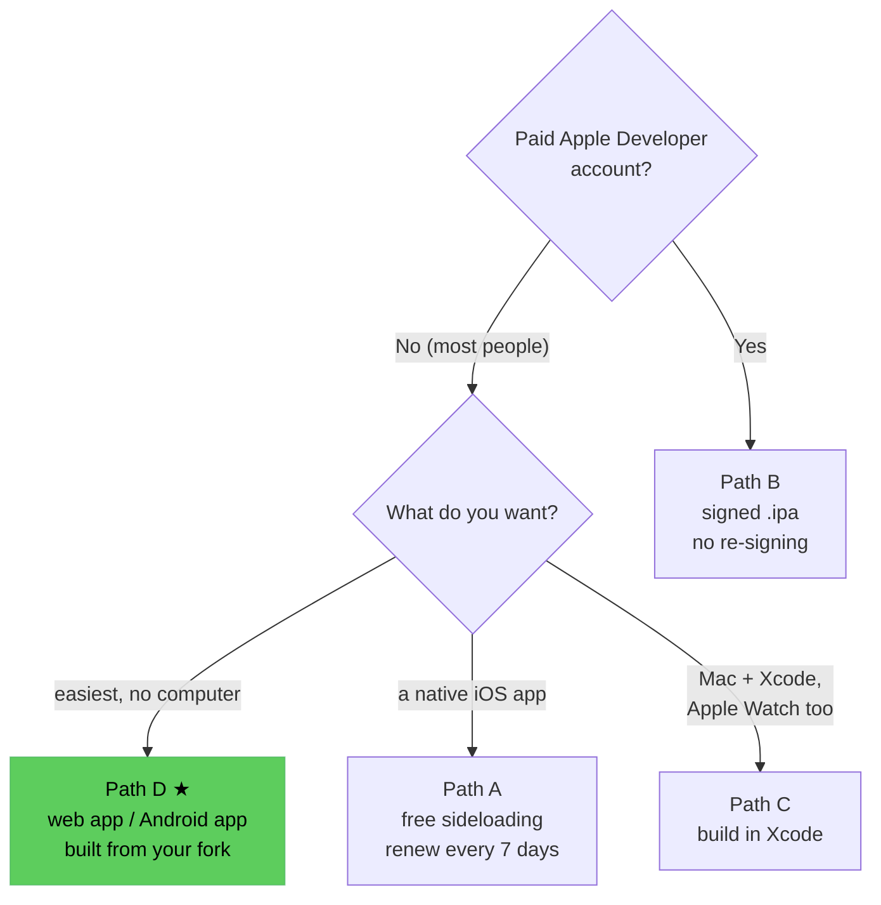
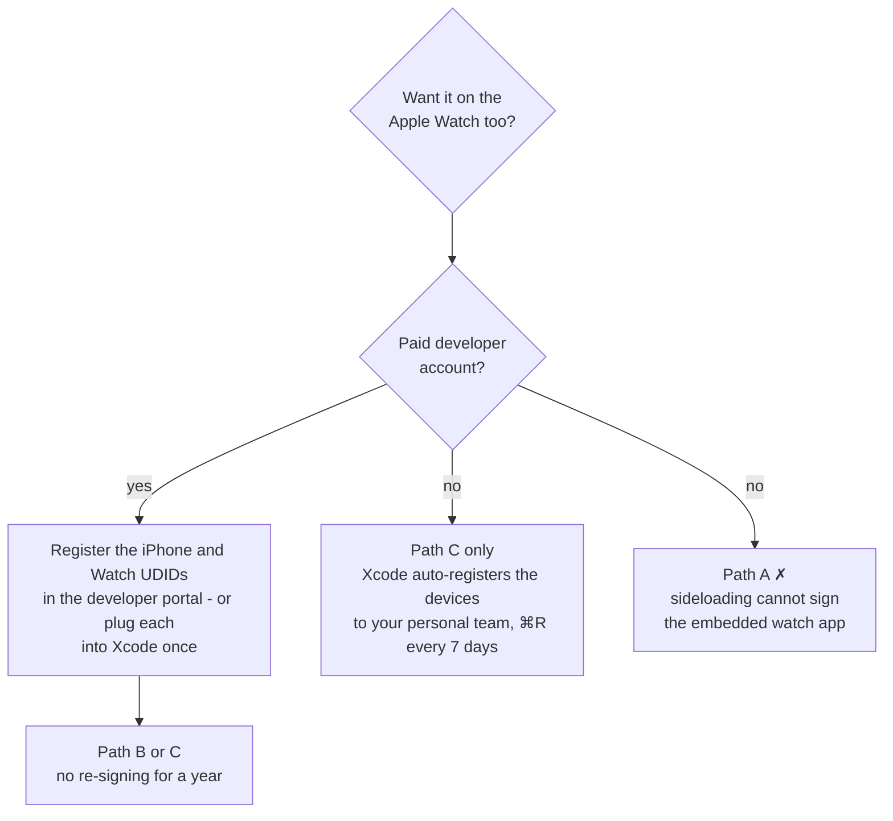
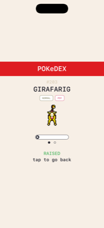
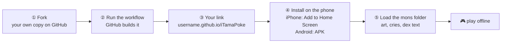
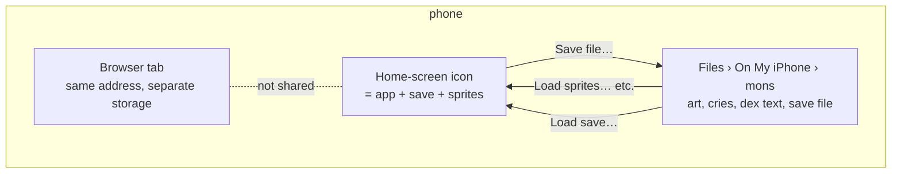
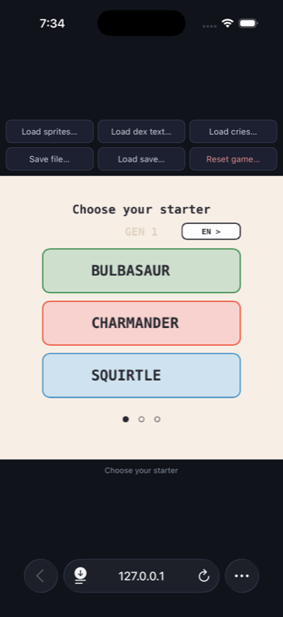
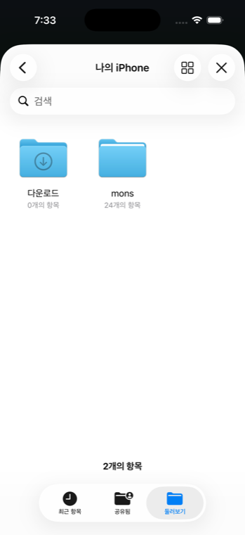
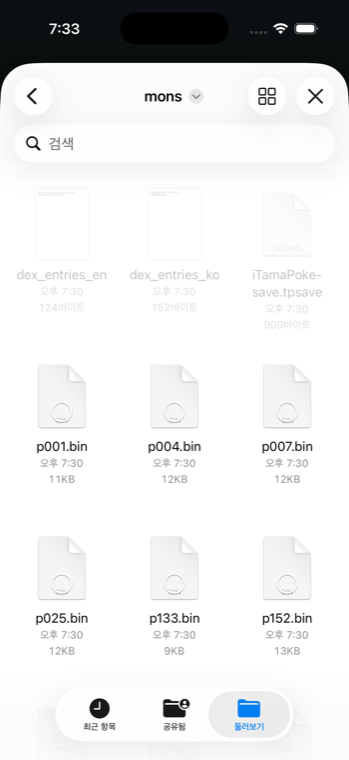
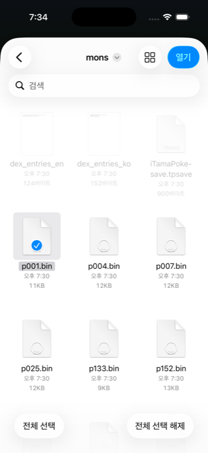

# Install guide (no coding knowledge needed)

[한국어](INSTALL.ko.md)

This assumes nothing except that you can download a file and follow steps.
If a term isn't explained inline, it's explained the first time it comes up.

> ⚠️ **Before you start:** this is a one-person hobby port, not a finished
> commercial app. The free-account install path below is still being
> verified across different devices, and bugs are possible anywhere in the
> app — especially around the Apple Watch. If something doesn't work, please
> don't assume it's something you did wrong.

## Which path should I take?



| Path | Recommendation | Needs | Time | Expiry | Apple Watch |
|---|---|---|---|---|---|
| **D web app / Android** | ★★★ start here | a phone, a free GitHub account | 10 min fork + 1 min install | never | ✗ |
| C build in Xcode | ★★ least effort, slightly less predictable | Mac + Xcode | 20 min | 7 days (free ID) / 1 year (paid) | ✓ |
| B signed install | ★★ most reliable, most prerequisites | paid developer account + Mac + a little dev know-how | 10 min | 1 year | ✓ (devices must be registered) |
| A free sideloading | ★ not recommended | iPhone, Mac or Windows, free Apple ID | 15 min | renew every 7 days | ✗ |

Whichever path, the game installs **without creature art**; you add
sprites, cries and dex text yourself → [Building the mons folder](#building-the-mons-folder).

### Apple Watch and developer accounts



- **Device registration is the whole story.** A signed build installs only
  on devices whose UDID is in its provisioning profile. With a paid
  account, register the iPhone and the Watch in the portal (Certificates,
  Identifiers & Profiles → Devices) **before** building; connecting each
  device to Xcode once registers it too. The "Build (signed)" workflow
  cannot register devices for you.
- **A free Apple ID** has no portal, but Xcode registers connected devices
  to your "personal team" automatically and installs with a 7-day profile.
  So Path C reaches the Watch on a free ID; you just rebuild weekly.
- **What a free ID cannot do:** sideload the watch app (Path A) or use the
  signed CI build (Path B).

There's also **Path C**, building it yourself with Xcode — only relevant if
you already have a Mac with Xcode and want to bake sprites directly into the
app instead of adding them afterward. **Path D** is the same game, same
screens, built as a web app (`browser_ver/`) that GitHub builds under your
own account once; after that it installs from your own link and runs on
the phone by itself, offline. No Mac, no developer account, no sideloading
tool, so **if this is your first time, start with Path D.**

---

## Building the mons folder

Every path uses the same one folder, named exactly `mons`.

```
mons/
├── p001.bin … p386.bin        creature sprites (normal)          ← required
├── ps001.bin … ps386.bin      creature sprites (shiny)           optional
├── thumbs.bin                 Pokédex thumbnail atlas (silhouettes of unseen species)   required on iOS, recommended on web
├── dex_entries_en.txt         Pokédex text, one file per language   optional
├── dex_entries_ko.txt
├── psnd001.m4a … psnd386.m4a  cries                              optional
├── iTamaPoke-save.json        the iOS app's save (written by the app)
└── iTamaPoke-save.tpsave      the web/Android save (from "Save file…")
```

| File | Source | How |
|---|---|---|
| `p###.bin`, `thumbs.bin` | [socquique/TamaPoke](https://github.com/socquique/TamaPoke) | **Code → Download ZIP** → the whole `tools/sdcard/mons` folder |
| `ps###.bin` (shiny) | PMD SpriteCollab | on a computer: `Scripts/pack_shiny_sprites.py` (optional) |
| `dex_entries_<lang>.txt` | PokéAPI | on a computer: `Scripts/fetch_dex_entries.sh --lang en` |
| `psnd###.m4a` | PokéAPI cries | on a computer: `Scripts/fetch_cries.sh` (needs `ffmpeg`) |
| all of the above at once | | `Scripts/fetch_assets.sh` |

- **Phone only:** the first row (the ZIP) is enough. Download it in Safari,
  tap it in the Files app to unpack, and `TamaPoke-main/tools/sdcard/mons`
  is the folder. Move that `mons` to the top of **On My iPhone** to keep it
  easy to find.
- **With a computer:** clone the repository, run `Scripts/fetch_assets.sh`,
  and everything lands in `Resources/mons/`. AirDrop or cloud-drive that
  folder to the phone.
- **Shiny sprites (`ps###.bin`) take a while.** `pack_shiny_sprites.py`
  fetches and converts each of the 386 source sheets from PMD SpriteCollab
  one by one — tens of minutes to over an hour depending on your
  connection. In a hurry, pass just the numbers you want
  (`Scripts/fetch_assets.sh --only shiny 25 133`). Grabbing sheets by hand
  from the site works too, but you'd be hunting through per-species
  folders.
- Partial sets are fine: a species without a file shows "?" and nothing
  breaks.
- None of these files are in this repository, and the app never uploads
  them anywhere.

**Where does it go?**

| | Location |
|---|---|
| iOS app (Paths A/B/C) | Files → On My iPhone → **iTamaPoke** → `mons` (read automatically) |
| Web app / Android (Path D) | Files → On My iPhone → `mons` (anywhere works — you pick it with **Load sprites…**) |

---

## Path A — Free install (Sideloadly or AltStore)

Works on **both Mac and Windows**. You'll need: your iPhone, its USB cable
(for the first step), and a free Apple ID (the same kind you already use for
the App Store — no paid account needed).

### 1. Download the app file

1. Open this repository's page in a browser and click the **Actions** tab
   near the top.
2. Click **Build (unsigned)** in the left sidebar.
3. Click the most recent run at the top of the list — it should have a green
   checkmark ✅ next to it.
4. Scroll down to **Artifacts** — there are two files. Download
   **`TamaPoke-unsigned-nowatch-ipa`** (iPhone only). It downloads as a
   `.zip` — unzip it, and you'll have a file called
   `TamaPoke-unsigned-nowatch.ipa`. That's the app, just not yet signed for
   your phone (see below for what that means).

   > Ignore `TamaPoke-unsigned-withwatch-ipa`. It's the same app with the
   > Apple Watch companion app built in, kept around for reference — but a
   > free Apple ID can't provision a second, embedded watch app, so AltStore
   > refuses to install that file at all, and Sideloadly installs the phone
   > app but silently drops the watch half. If you want this on your watch
   > without a paid developer account, use **Path C** below (Xcode, connected
   > directly to your paired watch) instead of sideloading.

### 2. Install a sideloading tool

An `.ipa` you download from the internet isn't signed for your specific
Apple account yet, so iOS won't install it directly. A **sideloading tool**
signs it with your own free Apple ID first. Pick one:

- **[AltStore](https://altstore.io)** — recommended if you want the app to
  keep renewing itself automatically (see step 5). Works on Windows and Mac.
- **[Sideloadly](https://sideloadly.io)** — simpler one-time install, but you
  repeat the renewal step by hand every 7 days. Also works on Windows and
  Mac.

Both are free, official-looking third-party tools widely used for exactly
this purpose — install whichever from its own website.

### 3. Sign and install

**With Sideloadly:**
1. Connect your iPhone to your computer with a USB cable, and open
   Sideloadly.
2. Drag `TamaPoke-unsigned-nowatch.ipa` into the Sideloadly window.
3. Enter your Apple ID email in the box provided.
4. Click **Start**. It'll ask for your Apple ID password at some point —
   this goes directly to Apple to sign the app, not to us or anyone else.
5. Wait for it to finish. The app appears on your phone's home screen.

**With AltStore:**
1. Install **AltServer** on your computer (from altstore.io) and follow its
   setup — it walks you through installing AltStore on your iPhone the
   first time, which needs the phone connected once.
2. Make sure your phone and computer are on the **same Wi-Fi network**.
3. On your iPhone, open the **AltStore** app → **My Apps** → tap the **+**
   button → choose `TamaPoke-unsigned-nowatch.ipa`.
4. Enter your Apple ID if asked. Wait for the install.

### 4. Trust the app on your iPhone

The first time you try to open it, iOS will refuse and tell you the
developer isn't trusted. Fix this once:

**Settings → General → VPN & Device Management** → tap the entry under
"Developer App" (it'll have your Apple ID's name on it) → **Trust**.

Now the app opens normally.

### 5. Add the creature art

The app installs with no Pokémon sprites in it — see [why in the main
README](../README.md#sprites). Add them like this:

1. On your computer, go to
   [github.com/socquique/TamaPoke](https://github.com/socquique/TamaPoke) →
   green **Code** button → **Download ZIP**.
2. Unzip it, and find the folder `tools/sdcard/mons` inside — that's a
   folder full of `.bin` files, one per creature, plus one called
   `thumbs.bin`.
3. Get that `mons` folder onto your iPhone — AirDrop (Mac), emailing it to
   yourself, or a cloud drive app all work. The point is just getting the
   files somewhere the **Files** app on your iPhone can reach.
4. On your iPhone, open the **Files** app → **On My iPhone** → **iTamaPoke**.
5. Inside that folder, create a new folder named exactly `mons` (if the
   files you transferred already came as a `mons` folder, you can just move
   that whole folder in instead of creating an empty one).
6. Copy the `.bin` files in — all of them for every creature, or just a few
   if you want to keep it small. **Make sure `thumbs.bin` is included too**
   — without it, the Pokédex screen shows nothing.
7. Fully close the iTamaPoke app (swipe it away in the app switcher) and
   reopen it. The creature should now appear instead of a placeholder.



*What it looks like once sprites (and optionally dex text/cries, next)
are correctly installed — portrait, type chips, and the cry-playback button
all present on the dex detail screen.*

Want dex entries and cries too? Both are optional and go in the same `mons`
folder — see [README "Pokédex entries"](../README.md#pokédex-entries) and
[README "Cries"](../README.md#cries). Cries need `ffmpeg` on the computer
you fetch them with (`brew install ffmpeg`), not on the iPhone.

This `.ipa` doesn't include the Apple Watch app — see the note in step 1. If
you want the game on a paired Apple Watch without a paid developer account,
use Path C below (build with Xcode, connected directly to your watch)
instead; there's no sideloading route to it on a free account.

### 6. Keep it working (every 7 days)

Apps signed with a free Apple ID stop opening after **7 days** — this is an
Apple restriction on free accounts, not a bug.

- **AltStore users:** leave AltServer running on your computer and keep your
  phone on the same Wi-Fi occasionally — it renews on its own.
- **Sideloadly users:** repeat step 3 by hand once a week. Your save data is
  untouched by this.

A free Apple ID can also only have **3 sideloaded apps** installed at once,
counting anything else you've sideloaded the same way.

---

## Path B — Signed install (paid Apple Developer account)

If you already pay $99/year for an Apple Developer account, this path skips
sideloading tools entirely and doesn't need re-signing for a year.

> If this isn't your own fork of the repository, first change
> `PRODUCT_BUNDLE_IDENTIFIER` in `project.yml` away from
> `com.allenst486db.itamapoke` to something unique to you — Apple's servers
> refuse to sign an identifier that's already registered to someone else's
> account.

1. In this repository, go to **Settings → Secrets and variables → Actions**
   and add four secrets — see the comments at the top of
   [`.github/workflows/build-signed.yml`](../.github/workflows/build-signed.yml)
   for exactly where each value comes from in your Apple Developer account.
2. Go to the **Actions** tab → **Build (signed)** → **Run workflow**.
3. Once it finishes (green checkmark), download the `TamaPoke-signed-ipa`
   artifact the same way as Path A step 1.
4. Install it with Apple Configurator or Xcode's Devices window — it's
   already signed for your registered devices, so no sideloading tool is
   involved.
5. Add sprites the same way as Path A step 5.

This path installs the Apple Watch app correctly and doesn't expire for a
year.

---

## Path C — Build with Xcode (Mac only)

For anyone who already has a Mac with Xcode and is comfortable typing a few
commands into Terminal. This is the most reliable path for the Apple Watch
specifically, and lets you bake sprites directly into the build instead of
adding them afterward.

If this isn't your own fork, change `PRODUCT_BUNDLE_IDENTIFIER` in
`project.yml` away from `com.allenst486db.itamapoke` first (same reason as
Path B above).

```bash
git clone --recurse-submodules https://github.com/allenst486db/iTamaPoke
cd iTamaPoke
brew install xcodegen
Scripts/fetch_sprites.sh all      # or a few dex numbers instead of "all"
xcodegen generate
open TamaPoke.xcodeproj
```

Building with none of that run at all works too — the app just starts with no
sprites, dex entries, or cries until you add them (see [README
"Sprites"](../README.md#sprites), ["Pokédex
entries"](../README.md#pokédex-entries), and ["Cries"](../README.md#cries)).
`Scripts/fetch_assets.sh` fetches sprites, shiny sprites, and cries together
in one call instead of running each script by hand; cries need `ffmpeg`
(`brew install ffmpeg`) first.

In Xcode: select the **TamaPoke** target → *Signing & Capabilities* → turn on
*Automatically manage signing* → pick your Apple ID as the team. Do the same
for **TamaPokeWatch**. Then plug in your iPhone, pick it as the run
destination, and press ⌘R. Repeat with the **TamaPokeWatch** scheme and your
Apple Watch as the destination.

Both iOS 16+ and watchOS 9+ need **Developer Mode** turned on once: Settings
→ Privacy & Security → Developer Mode → on, then restart. The watch has its
own separate toggle.

**Expiry:** a free Apple ID still expires after 7 days here too (Watch
included) — just press ⌘R again to renew. Signing with a paid account
gives a year; Xcode registers the connected devices in the portal for you.

With a Mac this is the least effort of the native paths. It is also the
one most likely to hit a one-off snag (Xcode version, signing state), so
for sheer reliability the signed `.ipa` of Path B is the safer bet.

### App icon

Ships with a small default mascot icon (see the main README). To use your
own image instead:

```bash
Scripts/fetch_app_icon.sh path/to/your/icon.png   # square, ideally 1024x1024
xcodegen generate
```

---

## Path D — Web app / Android app from your own fork (no Mac, no developer account)

The same game — same engine, same screens, same sprites, same sounds — built
as a web app, and as an Android package.



GitHub builds it once under your account (D0); then you open your link on
the phone, add it to the home screen (or install the APK), and from then on
it runs **on the phone by itself, offline**, like any other app: no App
Store, no sideloading, no 7-day expiry, nothing to keep running anywhere.
It keeps its own save; it doesn't share one with the iOS app.

What's at that link is code only. The Pokémon art, cries and Pokédex text
are **not** part of it — you put those on your phone yourself in D3, and the
app reads them from your phone's own storage. That's what keeps this
publishable: nothing of Nintendo's or of the sprite artists' is ever served.

**There is no shared link.** This repository doesn't host the game for
everyone — GitHub builds a copy *under your own account* instead, once, in
D0. That gives you a link of your own (`https://<your-name>.github.io/iTamaPoke/`)
that keeps working no matter what happens to this repository, and it's
what the LICENSE permits (a personal build for yourself; not a link to hand
around). Your game is never shared with anyone either way: the creature,
level, Pokédex, catches and sprites live inside your phone's app storage,
with no account and no server-side save. The flip side: nothing can restore
a save from outside the phone, so read D2.

### D0. Make your own link (10 minutes, once)

Needs a free GitHub account. Works from the phone's browser, but a
computer is more comfortable.

1. Sign in to GitHub and open this repository.
2. Click **Fork** (top right) → **Create fork**. You now have your own copy
   at `github.com/<your-name>/iTamaPoke`. Leave it public — GitHub Pages
   on a free account only works for public repositories.
3. In *your* copy: **Settings** → **Pages** (left column) → under **Build
   and deployment**, set **Source** to **GitHub Actions**.
4. **Actions** tab → click **I understand my workflows, go ahead and
   enable them** → click **Build (browser)** in the left column → **Run
   workflow** → **Run workflow**.
5. Wait for the green check ✅ (about five minutes; it builds the web app
   and the Android package). Your link is
   **`https://<your-name>.github.io/iTamaPoke/`** — it's also shown on the
   run's page under *publish*.

Later, to pick up changes from this repository: on your copy click
**Sync fork** → **Update branch**. Your site rebuilds by itself, and
installed copies update on their next launch.

### D1. Install it (1 minute)

- **iPhone / iPad**: open your link in **Safari** (it has to be Safari, not
  Chrome or an in-app browser). Tap the **Share** button (the square with an
  arrow) → scroll down → **Add to Home Screen** → **Add**. An **iTamaPoke**
  icon appears on your home screen; close Safari and open the game from
  that icon from now on.
- **Android**: install the real app instead. In Chrome, open
  **`https://<your-name>.github.io/iTamaPoke/iTamaPoke.apk`** — the file
  downloads (a few MB). Pull down the notification shade and tap the
  download, or open it from **Files → Downloads**. Android will say the app
  is from an unknown source: tap **Settings** → allow **Chrome** (or your
  file manager) to install unknown apps → back → **Install**. It's a normal
  app after that: its own icon, works offline, updates by installing a
  newer `.apk` over it (your save is kept). If you'd rather not install an
  APK, the web link works in Chrome too (⋮ → **Install app**), with the
  same "play it from the icon" rule as iPhone.

### D2. The icon and the save (read this once)



- **The save lives inside the icon.** It autosaves every 15 seconds and
  whenever you leave the screen. A browser tab at the same address is a
  *separate* app with a separate save and separate sprites — always play
  from the icon.
- **Deleting the icon deletes the save** (iPhone). Before reinstalling, use
  **Save file…** first.
- **Save file…** (button on the right): exports the current state as
  `iTamaPoke-save.tpsave`. On iPhone the share sheet opens — **Save to
  Files** → your `mons` folder. That's your backup, and how you move to
  another phone.
- **Load save…**: picks that file and restores it (replaces the current
  creature).
- **Reset game…**: wipes the save only and starts a new egg; sprites stay.
  Use it when a wrong state keeps showing.
- After the first launch it needs **no internet**. New versions are picked
  up on the next launch with internet.



*First run: the starter picker, with the six load / save / reset buttons
above the game.*

### D3. Add the characters (5 minutes, once per device)

The game starts with a "?" where each creature should be. This is on
purpose — see [README "Sprites"](../README.md#sprites). You add the art
yourself, on the phone, with no computer:

1. Get a `mons` folder onto the phone. Any way works, as long as it ends
   up under **Files → On My iPhone** (Android: **My Files → Internal
   storage**). Easiest:
   [github.com/socquique/TamaPoke](https://github.com/socquique/TamaPoke) →
   green **Code** button → **Download ZIP** → tap the zip once in the Files
   app; it unpacks into `TamaPoke-main`, and `tools` → `sdcard` → `mons`
   inside it is the folder. If you already keep a `mons` folder with
   sprites, cries and dex text for the iOS app, use that one as is.
2. Open the app and tap **"Load sprites…"** in the toolbar. The file
   picker opens on **"No Recents"** — tap **Browse** at the bottom, then
   **On My iPhone** → **mons**.

   

3. Inside `mons`, the `.bin` files are solid and the `.txt` / `.tpsave`
   ones are greyed out. That's correct: each button only accepts its own
   file type, so it doesn't matter what else is in the folder.

   

4. **Tap one file** and a **Select All** button appears at the bottom. Tap
   it, then **Open** at the top right.

   

   - Android: long-press a file → **Select all** → **Select**.
5. Wait for the button to read "Loaded N file(s)". The characters appear
   immediately and stay — this is stored inside the app, so you do it once.
6. If cries and dex text are in that same `mons` folder, do the same
   "Select All" once each for **"Load cries…"** and **"Load dex text…"**.

Two more buttons work the same way and are optional:

- **"Load dex text…"** — the encyclopedia blurb on the dex detail screen's
  second page. The files come from `Scripts/fetch_dex_entries.sh` in this
  repository, which needs a computer with a terminal. Skip it if that's not
  for you; nothing else depends on it.
- **"Load cries…"** — each species' cry on the dex detail screen. From
  `Scripts/fetch_cries.sh`, which needs `ffmpeg` on a computer. Also
  optional. Cries play only when the sound setting is on full, same as the
  iOS app.

Nothing you pick is uploaded anywhere. It stays in that app on that phone.

### D4. On a computer instead

The same link works in any desktop browser (Chrome, Edge, Safari, Firefox),
with the same "Load sprites…" flow pointing at the unzipped `mons` folder.
Chrome and Edge offer an **Install** button in the address bar for a
windowed app. The save is per browser.

### Path D troubleshooting

**Picked one starter, a different name shows / no creature at all.** An
old, broken save is still in the app. Tap **Reset game…** (right side) and
start from the egg; if the art is gone too, **Load sprites…** again.

**The page says "loading…" and nothing happens.** Usually an old cached
copy from a previous version. Close the app fully (swipe it away), make
sure you have internet, and open it again. Once it has loaded, it works
offline again.

**Android: "App not installed" / "Blocked by Play Protect".** Play
Protect flags any app that isn't from the Play Store, which this one
isn't. Tap **More details** → **Install anyway**. It's the debug-signed
build the workflow produces from this repository's source; nothing is
downloaded from anywhere else.

**"Add to Home Screen" is missing on iPhone.** You're not in Safari —
Chrome, the GitHub app, Kakao/Line's built-in browser, etc. can't install
web apps on iOS. Copy the link and open it in Safari.

**No character art, just a "?".** The sprites haven't been loaded on *this*
phone yet, or they were loaded into a browser tab rather than the
home-screen app (they're separate). Open the game from the icon and do D3
there.

**The file picker shows the `.bin` files greyed out.** The picker filters
by type; tap **Browse** / switch to the folder view, or pick them from the
`mons` folder directly rather than through "Recents".

**Sound doesn't play.** The game starts silent, and browsers block audio
until you've tapped something. Swipe down for settings and tap the sound
pill until it reads FULL.

**My save is gone.** Most likely you opened the game in a browser tab
instead of from the home-screen icon (separate saves), or the icon was
deleted and re-added (on iPhone that wipes its data). The save is never on
any server, so nothing can restore it from outside the phone — treat the
icon as the thing that holds it.

### Keep your link to yourself

LICENSE allows your fork's site for your own play, not as a place for
other people to get the game. If a friend wants it, send them here so they
make their own in D0 — it's ten minutes and costs nothing.

For developers: the site is produced by
[`.github/workflows/build-browser.yml`](../.github/workflows/build-browser.yml)
(Emscripten compiles `upstream-expanded/` + `browser_ver/core/` to WASM,
Gradle builds the Android shell, the folder deploys to GitHub Pages).
Local builds: `browser_ver/README.md`.

---

## Troubleshooting

**"Unable to install" / install just fails silently.** Free Apple IDs allow
3 sideloaded apps at once — check you're not over that limit with other apps.

**The app opens but immediately closes.** Usually means the developer trust
step (Path A, step 4) hasn't been done yet.

**No creature, just a placeholder.** The sprite files aren't in the right
place — double check the folder is named exactly `mons` and sits directly
inside the app's Files folder, and that you fully restarted the app after
adding files.

**Pokédex screen is empty.** Missing `thumbs.bin` specifically — it's easy
to miss since it's one extra file among 151+.

**Apple Watch shows a placeholder even after waiting.** Open the watch app
directly and leave it on screen for a minute — delivery from the phone can
lag while the watch isn't actively being looked at, which is a known
characteristic of how Apple's phone-to-watch file transfer works, not
something specific to this app.

**Something else looks broken.** This is genuinely possible — see the
warning at the top of this page. Feel free to open an issue on this
repository describing what you saw.
