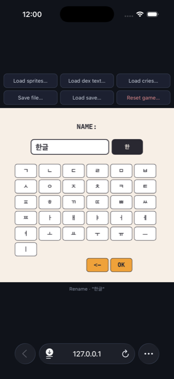

# v0.9.2 — Hangul nicknames, and the evolve button stops covering FEED

## New

- **Hangul keyboard for nicknames.** The rename keyboard now has a **ABC /
  한** toggle: the Korean side puts every jamo on its own key and composes
  them into syllables as you type, the way a normal 2-set (두벌식) IME does
  — ㅎ ㅏ ㄴ becomes 한, a following ㄱ ㅡ ㄹ becomes 글, backspace walks back
  one jamo at a time, and compound vowels and finals (ㅘ, ㅐ, ㄳ, ㅄ …) form
  and split correctly.

  The automaton lives in `Sources/Core/hangul.cpp` and is compiled into
  **both** builds from that one file, so the iOS/watchOS keyboard and the
  browser keyboard cannot drift apart.

  

  Not Chunjiin (천지인): with 466px of screen every jamo fits as its own
  key, which needs no multi-tap timing and no disambiguation. Upstream
  turned Korean down because the firmware's ASCII bitmap font has no Hangul
  glyphs (socquique/TamaPoke#5) — both of this port's renderers draw with a
  real system font, so the only missing piece was a way to type it.

- **`Pet::nick` widened to 24 bytes** (was 12) so a Korean nickname fits:
  a syllable costs 3 bytes of UTF-8, and 11 usable bytes held only three of
  them. Seven now fit; ASCII names are unchanged at 11 characters. Existing
  saves load as they are. This is the second deliberate local change to the
  vendored fork — see `upstream-expanded/README.md`.

## Fixed

- **The evolve / farewell / runaway call-to-action covered the action
  buttons** in the browser build. It was drawn at y 372, right on top of
  FEED — so once the CTA appeared there was no way to feed the creature,
  which is exactly what you need to do to raise a stat back to 40 and
  actually evolve. Both buttons now sit where the iOS app puts them
  (`TP.evoBtn` / `TP.farBtn`, mid-screen), with hit rects to match, and the
  evolve / farewell dialog's two options moved to their iOS coordinates as
  well.

---

# v0.9.2 — 한글 별명 입력, 진화 버튼이 먹이 버튼을 가리던 문제 수정

## 새로 추가

- **별명용 한글 키보드.** 이름 변경 키보드에 **ABC / 한** 전환이 생겼습니다.
  한글 쪽은 자모를 하나씩 키로 두고 입력하는 대로 음절로 조합합니다(두벌식
  방식) — ㅎ ㅏ ㄴ 이면 한, 이어서 ㄱ ㅡ ㄹ 이면 글이 되고, 백스페이스는
  자모 하나씩 되돌리며, 복합 모음·받침(ㅘ, ㅐ, ㄳ, ㅄ …)도 정확히 합쳐지고
  분리됩니다.

  조합기는 `Sources/Core/hangul.cpp` 한 파일에 있고 **두 빌드가 같은 파일을**
  컴파일하므로, iOS/워치 키보드와 브라우저 키보드가 서로 달라질 수 없습니다.

  

  천지인 방식은 아닙니다. 466px 화면에는 자모를 전부 개별 키로 놓을 수 있어
  연속 탭 타이밍이나 모호성 처리가 필요 없습니다. 원작이 한글화를 거절했던
  이유는 펌웨어의 ASCII 비트맵 폰트에 한글 글리프가 없기 때문인데
  (socquique/TamaPoke#5), 이 포팅의 두 렌더러는 시스템 폰트로 그리므로
  남은 건 "입력 수단"뿐이었습니다.

- **`Pet::nick`을 24바이트로 확장**(기존 12). 한글 한 글자가 UTF-8 3바이트라
  쓸 수 있는 11바이트로는 세 글자밖에 안 들어갔습니다. 이제 일곱 글자까지
  되고, 영문 이름은 기존과 같이 11자입니다. 기존 세이브는 그대로 읽힙니다.
  vendored 포크에 대한 두 번째 의도적 수정입니다 —
  `upstream-expanded/README.md` 참고.

## 수정

- **진화/작별/가출 버튼이 액션 버튼을 가림**(브라우저 빌드). y 372에 그려져
  FEED 버튼 위를 덮고 있었습니다. 그래서 버튼이 뜨고 나면 먹이를 줄 수 없고,
  스탯을 40으로 되돌려 진화시키는 것 자체가 불가능했습니다. 이제 iOS와 같은
  위치(`TP.evoBtn` / `TP.farBtn`, 화면 중앙)에 그려지고 탭 영역도 함께
  맞췄으며, 진화/작별 확인 대화상자의 두 버튼도 iOS 좌표로 옮겼습니다.
